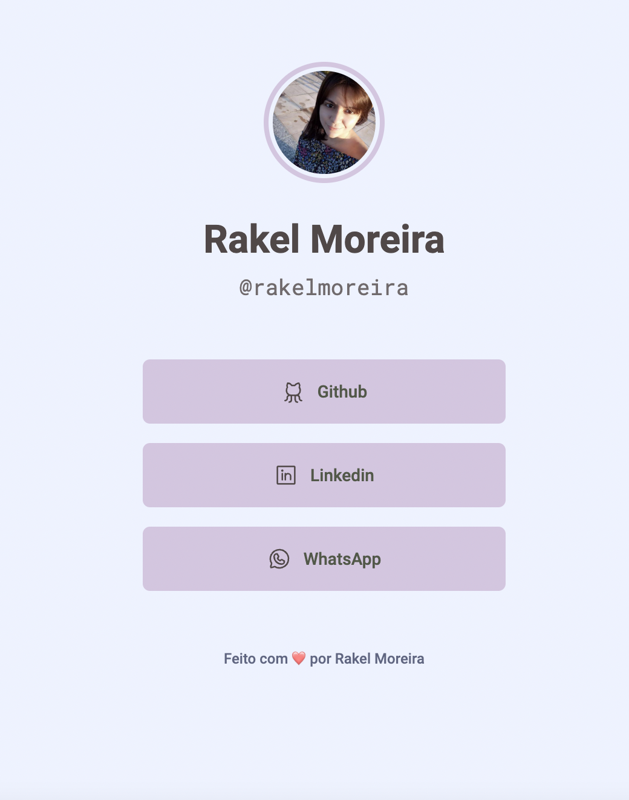

  <a href="#-tecnologias">Tecnologias</a>&nbsp;&nbsp;&nbsp;|&nbsp;&nbsp;&nbsp;
  <a href="#-projeto">Projeto</a>&nbsp;&nbsp;&nbsp;|&nbsp;&nbsp;&nbsp;

    

## 🚀 Tecnologias

- CSS
- HTML

## 💻 Projeto

O layout foi baseado no projeto da Maratona explorer 2.0.

<h5 align="center"><a href="https://rakelmm.github.io/meus-links/">ACESSE AQUI O PROJETO FINAL</a></h5>

---

Feito com ❤️ por Rakel Moreira!